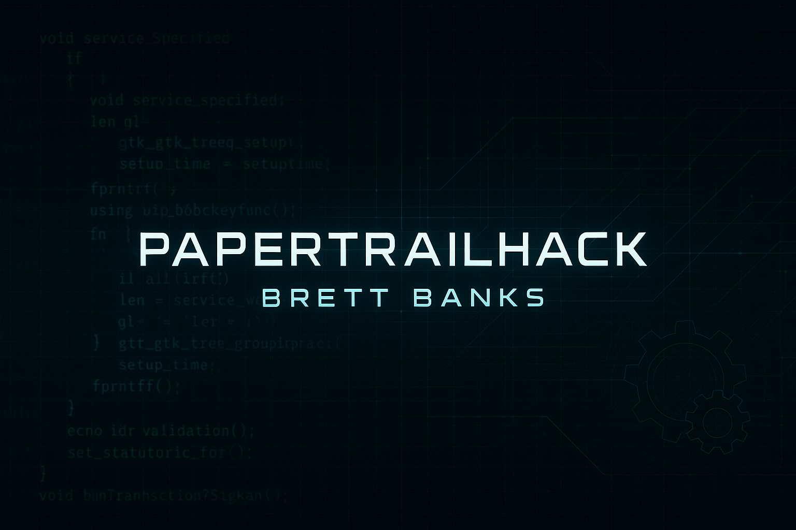

# 👋 Hi, I’m @Papertrailhack (Brett Banks)

Welcome to my GitHub. I’m a former industrial engineer now diving headfirst into cybersecurity—bringing with me a builder’s mindset, precision under pressure, and a hunger for solving high-stakes problems in complex systems.

---

### 👀 I’m interested in:
- Threat detection & adversary emulation  
- SIEM tuning, log analysis, and automation  
- Red team tooling and purple team collaboration  
- ICS/SCADA security and OT infrastructure defense  

---

### 🌱 I’m currently learning:
- Detection engineering with Zeek, Splunk, and Suricata  
- Scripting automation with Python (packet analysis, tooling)  
- Real-world simulation using TryHackMe & custom lab environments  
- Preparing for CompTIA Security+ and Pentest+ certifications  

---

### 💻 Recent Projects:
- **Zeek Threat Detection Lab**: Simulated FTP attacks and parsed PCAPs into IOC reports  
- **Splunk Mini SIEM Project**: Configured alerts, dashboards, and log forwarding in a lab SIEM setup  
- **AI-RedOps**: Experimenting with AI-assisted adversarial simulation scripting  
- More coming soon...

---

### 💞️ I’m looking to collaborate on:
- SOC analyst playbook automation  
- Detection rule creation (Sigma, Splunk, Zeek)  
- Open-source threat intelligence tooling  
- Blue/Red team hybrid lab development  

---

### 📫 How to reach me:
- Email: brettcbanks@proton.me  
- LinkedIn: [linkedin.com/in/brettbanks1](https://www.linkedin.com/in/brettbanks1)  
- Portfolio: [https://github.com/papertrailhack](https://github.com/papertrailhack)

---

### ⚡ Fun fact: I used to manage complex mechanical systems in high-risk industrial environments—and now I apply that same discipline to hunting threats in digital ones.

---

Thanks for stopping by. Let’s build, break, and secure things—together.
